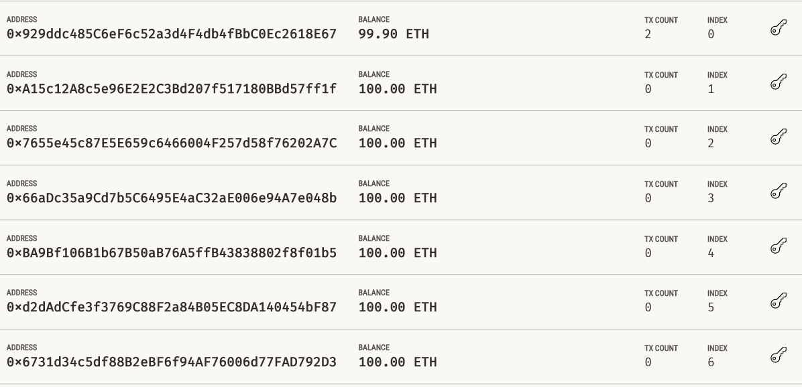
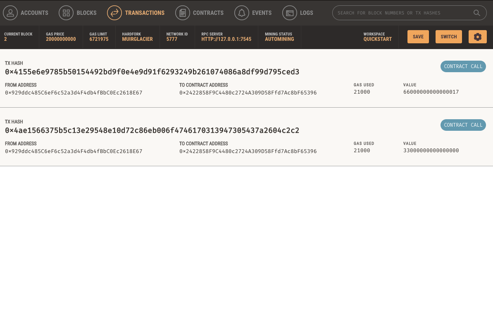

## Fintech Finder

This is an app to use a crypto wallet to hire a Web3 contractor.  The app is built in Python and uses streamlit and ganache.

---

## Use

Once the wallet is configured (which is done outside this app using ganache), the user simply selects the worker they would like to hire.

Following that selection, the user enters the number of hours they would like the contractor to work.

Once the transaction is submitted, a transaction hash appears in the lower left of the screnn.

The transaction removes eth from the user's account.

The eth is added to the contractor's account.

---

## Contributors

This project was created as a part of the Rice FinTech Bootcamp.

---

## License

This software is licensed for use under the included MIT License.
